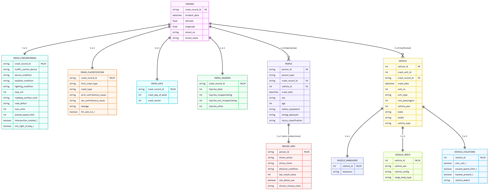
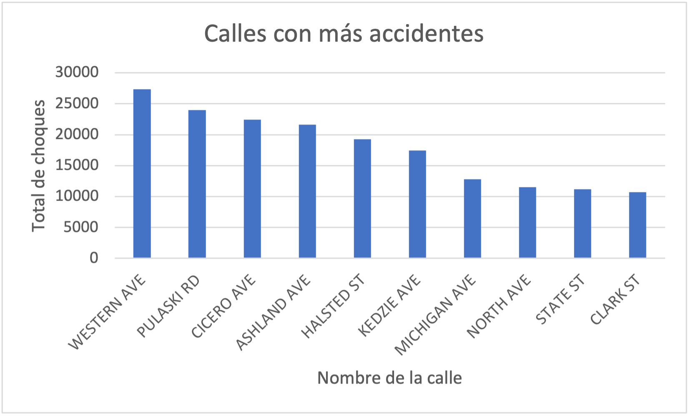
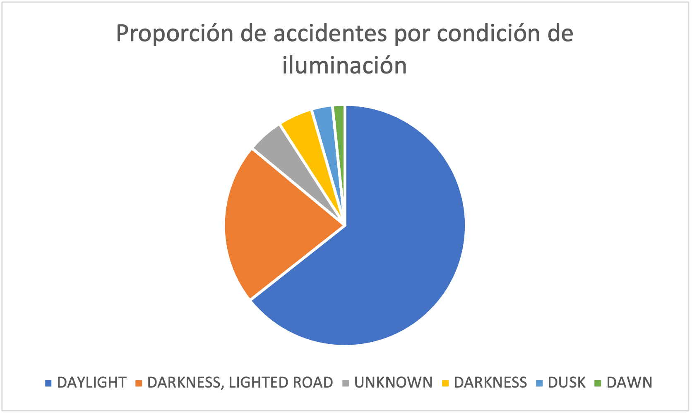
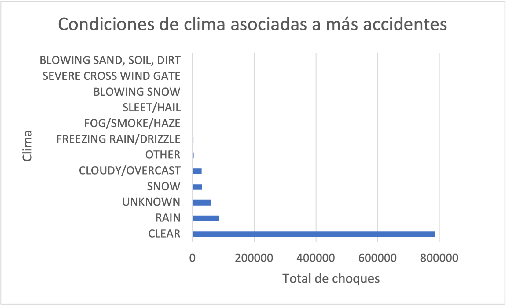
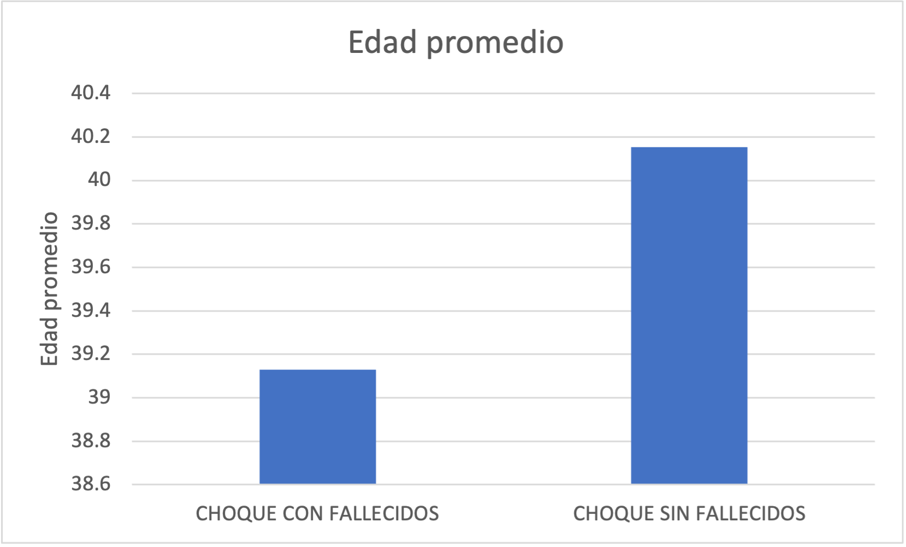
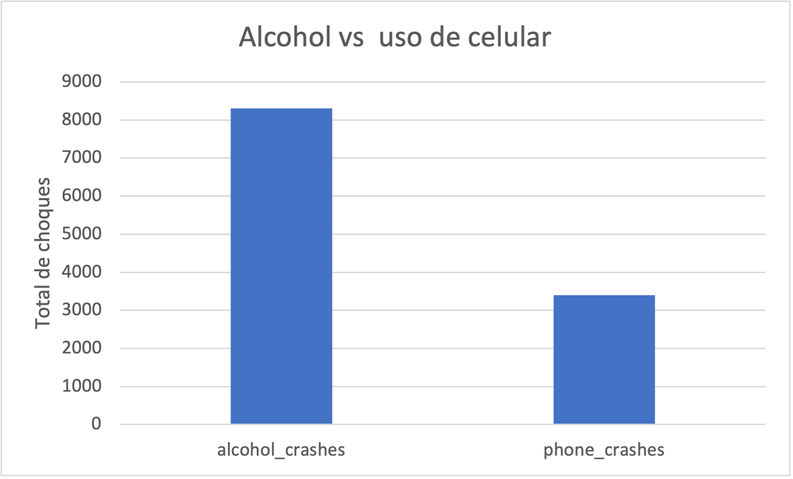
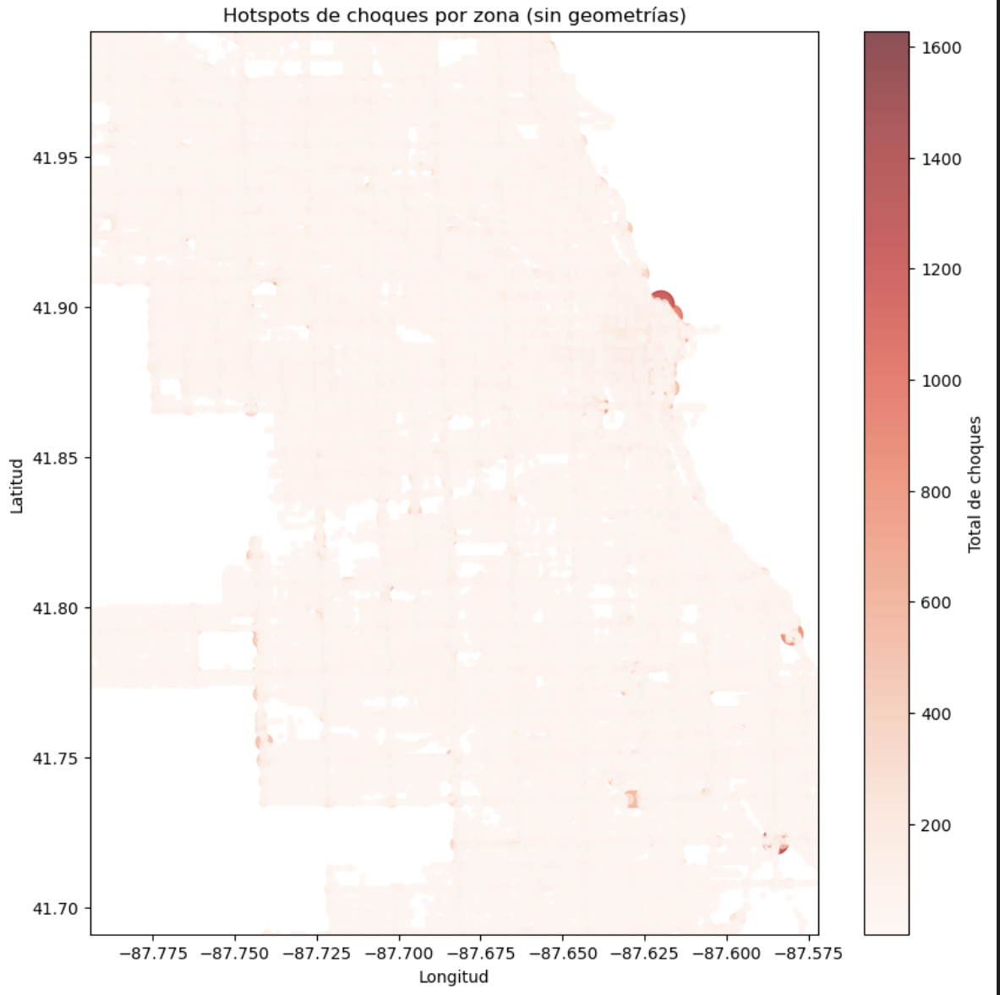

# Proyecto: Análisis de accidentes de tráfico en Chicago

## Integrantes
- Regina Cabral
- Alondra Valdivia
- Gabriel Navarro
- Iker Navarro
- Ricardo Limón

## Descripción general 

El conjunto de datos de “Accidentes de Tráfico de Chicago” es un registro público que contiene información detallada de cada choque reportable dentro de los límites de la ciudad y bajo la jurisdicción del Departamento de Policía de Chicago (CPD). Incluye circunstancias, causas y consecuencias de los incidentes viales, desde daños materiales menores hasta colisiones fatales.

Para este proyecto se usarán los datasets públicos: **Traffic Crashes - Crashes**, **Traffic Crashes - Vehicles** y **Traffic Crashes - People**, obtenidos del [Chicago Open Data Portal](https://data.cityofchicago.org/).  

Los datos son recolectados diariamente por el CPD a través del sistema **E-Crash**, con el objetivo de mantener registros oficiales, apoyar iniciativas de seguridad pública y permitir al Departamento de Transporte de Chicago (CDOT) identificar áreas de riesgo y evaluar proyectos de seguridad vial.

**Enlaces a los datasets:**
- [Crashes](https://data.cityofchicago.org/Transportation/Traffic-Crashes-Crashes/85ca-t3if/about_data)  
- [Vehicles](https://data.cityofchicago.org/Transportation/Traffic-Crashes-Vehicles/68nd-jvt3/about_data)  
- [People](https://data.cityofchicago.org/Transportation/Traffic-Crashes-People/u6pd-qa9d/about_data)  

Se encuentran en la siguiente liga:
https://drive.google.com/drive/folders/1yLkiUzb7McJdgqxMaWTjacWBjmKta2e6?usp=drive_link
---

## Resumen de datos

| Dataset | Tuplas | Atributos |
|:-------:|:------:|:---------:|
| Crashes | 989,000 | 48 |
| Vehicles | 2,020,000 | 71 |
| People | 2,170,000 | 29 |

> El conjunto solo incluye choques donde el CPD fue la agencia respondedora; accidentes en autopistas interestatales y algunas carreteras limítrofes están excluidos.

---

## Atributos 

### Traffic Crashes - Crashes

| Atributo | Tipo | Descripción |
|:---------|:----:|:-----------|
| crash_record_id | Texto | Identificador único del accidente |
| crash_date | Fecha/Hora | Fecha y hora del accidente |
| crash_hour | Numérico | Hora del accidente |
| crash_day_of_week | Numérico | Día de la semana (1=domingo) |
| crash_month | Numérico | Mes del accidente |
| posted_speed_limit | Numérico | Límite de velocidad |
| lane_cnt | Numérico | Número de carriles |
| traffic_control_device | Categórico | Dispositivo de control de tráfico |
| device_condition | Categórico | Estado del dispositivo |
| weather_condition | Categórico | Condiciones climáticas |
| lighting_condition | Categórico | Condiciones de iluminación |
| first_crash_type | Categórico | Tipo de primera colisión |
| crash_type | Categórico | Severidad general del accidente |
| prim_contributory_cause | Categórico | Causa primaria del accidente |
| sec_contributory_cause | Categórico | Causa secundaria |
| latitude / longitude | Numérico | Coordenadas geográficas |
| street_name / street_no / street_direction | Texto | Dirección del accidente |
| num_units | Numérico | Número de unidades involucradas |
| injuries_total / fatal / incapacitating / non_incapacitating / no_indication / unknown | Numérico | Total y tipo de lesiones |
| most_severe_injury | Categórico | Lesión más grave observada |
| report_type | Texto | Tipo de reporte administrativo |
| photos_taken_i / statements_taken_i / dooring_i / work_zone_i / workers_present_i | Categórico | Indicadores de observación |

---

### Traffic Crashes - Vehicles

| Atributo | Tipo | Descripción |
|:---------|:----:|:-----------|
| crash_record_id | Texto | Relaciona con Crashes |
| vehicle_id / crash_unit_id / unit_no | Numérico | Identificadores de vehículo |
| vehicle_type / make / model | Categórico | Tipo, marca y modelo |
| vehicle_year | Numérico | Año del modelo |
| occupant_cnt / num_passengers | Numérico | Cantidad de ocupantes |
| unit_type / maneuver / travel_direction / towed_i / fire_i / exceed_speed_limit_i | Categórico | Características y condiciones del vehículo |
| cargo_body_type / load_type / hazmat_present_i | Categórico | Información de carga y materiales peligrosos |
| crash_date | Fecha/Hora | Fecha y hora del accidente |

---

### Traffic Crashes - People

| Atributo | Tipo | Descripción |
|:---------|:----:|:-----------|
| person_id | Texto | Identificador de la persona (P=pasajero, O=otro) |
| crash_record_id | Texto | Relaciona con Crashes |
| vehicle_id | Texto | Relaciona con Vehicles |
| person_type | Categórico | Conductor, pasajero, peatón o ciclista |
| age | Numérico | Edad de la persona |
| sex | Categórico | Género |
| seat_no | Categórico | Posición en el vehículo |
| drivers_license_state / drivers_license_class | Categórico | Información de licencia de conducir |
| safety_equipment / airbag_deployed / ejection | Categórico | Equipo de seguridad y resultados del accidente |
| injury_classification | Categórico | Severidad de lesión |
| hospital / ems_agency / ems_run_no | Texto | Atención médica y transporte |
| driver_action / driver_vision / physical_condition | Categórico | Comportamiento y condición del conductor |
| pedpedal_action / pedpedal_visibility / pedpedal_location | Categórico | Acción y ubicación de peatón/ciclista |
| bac_result / bac_result_value | Categórico / Numérico | Prueba de alcohol en sangre |
| cell_phone_use | Categórico | Uso de celular al momento del accidente |
| crash_date | Fecha/Hora | Fecha y hora del accidente |

---

## Objetivo del Proyecto

El objetivo del análisis es identificar **factores de riesgo** y **patrones de accidentes** para proponer medidas que mejoren la seguridad vial.  

**Enfoques posibles:**
- **Seguridad Vial:** Analizar clima, hora, tipo de vehículo y condiciones de la vía sobre la severidad de lesiones.  
- **Espacial:** Identificar calles e intersecciones con mayor concentración de accidentes (*hotspots*).  
- **Temporal:** Detectar tendencias por hora, día de la semana y estación del año.  
- **Comportamiento de Conductores:** Evaluar infracciones, distracciones y consumo de alcohol.  
- **Multidimensional:** Cruzar atributos como tipo de vehículo, hora y clima para análisis más completos.

---

## Consideraciones Éticas

- **Protección de la Privacidad:** El dataset está anonimizado. No se deben intentar re-identificar personas.  
- **Precisión y Limitaciones:** Los datos pueden contener errores o sesgos; el análisis debe considerarlos.  
- **Equidad y Desigualdad Social:** Las fatalidades no se distribuyen uniformemente; se debe tener cuidado de no reforzar prejuicios.  
- **Comunicación Responsable:** Presentar hallazgos con contexto; un alto número de accidentes puede reflejar mayor tráfico y no necesariamente un diseño peligroso de la vía.

---
## Limpieza de datos
El proceso de limpieza de datos se llevó a cabo de manera incremental y sistemática sobre cada una de las tablas creadas, con el objetivo de garantizar consistencis, eliminar valores inválidos y estandarizar los formatos antes de realizar análisis y consultas complejas. 

Uno de los principales problemas detectados fue a presencia de valores nulos no explícitos, es decir, cadenas vacías (`''`) o valores de texto que representaban ausencia de información. Para solucionarlo, se aplicaron funciones como `NULLIF`, `BTRIM`  y `COALESCE`, tranformando estos registros en valores `NULL` reales dentro de PostgresSQL.

En la tabla **`people`** se normalizaron atributos como **`people_type`**, **`sex`**, **`safety_equipment`**,**`airbag_deployed`** e **`injury_classification`**, eliminando cadenas vacías y estandarizando los valores. De manera similar, en la tabla **`vehicle`** se limpiaron campos textuales como **`unit_type`**, **`make`**, **`model`** y **`vehicle_type`**.

Para las tablas especializadas de vehiculos (**`vehicle_models`**, **`vehicle_maneuvers`**, **`vehicle_violations`**) se aplicaron transformaciones adicionales para eliminar espacios innecesarios y corregir valores inválidos, garantizando que los atributos categóricos fueran consistentes y utilizables en análisis posteriores. 

En el caso de **`driver_info`**, se realizó una limpieza más exhaustiva debido a la variedad de valores en atributos como **`driver_action`**, **`driver_vision`**, **`physical_condition`** y **`drivers_license_class`**. Se eliminaron caracteres no válidos, se estandarizó el uso de mayúsculas y se validaron las expresiones mediante expresiones regulares para asegurar la coherencia de los registros. 

Por último, en **`crash_injuries`** se detectó la presencia de valores nulos en campos númericos críticos. Para evitar incosistencias en los cálculos, los valores fueron sustituidos por ceros utilizando **`COALESCE`**, bajo el supuesto de que la ausencia de registros implicaba la inexistencia de lesiones de ese tipo. 

Al concluir este proceso, se obtuvo un conjunto de tablas con datos limpios, correctamente tipados y coherente entre sí, listos para su análisis y para garantizar integridad durante la normalización. 

### Replicación
Esta sección describe cómo reproducir el proceso de limpieza de la base de datos a partir de los archivos originales, utilizando Python y Jupyter Notebooks.

1. Requisitos
Para ejecutar los scripts de limpieza es necesario contar con:
* Python 3.9 o superior
* Jupyter Notebook
* Librerías de Python:
    * pandas
    * numpy
 
2. Estructura relevante del proyecto
Los notebooks responsables del proceso de limpieza son los siguientes:
	- trim_crashes.ipynb
	- trim_vehicles.ipynb
	- Pedestrian_info.ipynb
	- Crash_classification.ipnynb
	- limpieza_people_people.ipynb
	-  limpieza_people_driver_info.ipynb
	-  crash_injuries_build.ipynb
    -  vehicles_buildcsv.ipynb
	-  LimpiezaCrashes.ipynb

Cada notebook se encarga de limpiar y estandarizar una o más tablas específicas del modelo de datos.

3. Orden de ejecución
Para reproducir correctamente la limpieza, los notebooks deben ejecutarse en el siguiente orden:
	1. trim_crashes.ipynb
       Limpieza inicial del conjunto de datos Traffic_Crashes_Crashes
	2. trim_vehicles.ipynb
	   Limpieza inicial del conjunto de datos Traffic_Crashes_Vehicles
	3. limpieza_people_people.ipynb
       Normalización y estandarización de atributos de personas involucradas.
	4. limpieza_people_driver_info.ipynb
       Limpieza de información específica de conductores
	5. crash_injuries_build.ipynb
       Limpieza y construcción de variables relacionadas con lesiones
	6. LimpiezaCrashes.ipynb
       Limpieza y normalización de crashes
	7. Pedestrian_info.ipynb
       Limpieza y normalización de atributos relacionados con peatones
	8. Crash_classification 
	   Limpieza de crash_classification
    9. vehicles_buildcsv.ipynb
       Limpieza y normalización de vehicles
---
## Normalización de datos

La estructura final del modelos de datos refleja un proceso de normalización que alcanza la cuarta forma normal (4NF), al eliminar redundancias y asegurar que cada atributo depende únicamente de la llave primaria de su tabla. 

Cada tabla representa una entidad claramente definida: 
- **Crashes** : información base del accidente.
- **Crash_date**, **crash_circumstances**, **crash_injuries**, **crash_classification**: descomposición funcional del accidente en subconjuntos lógicos de atributos.
- **Vehicle** y sus tablas asociadas: modelan de forma independiente a cada vehículo involucrado.
- **People** y driver_info: separan información general de personas de informacion exclusiva de conductores.

Las dependencias funcionales principales observadas incluyen: 
- `{crash_record_id} →` atributos del accidente y sus subcomponentes.
- `{vehicle_id} →` atributos propios del vehículo
- `{person_id} →` atributos personales y, en el caso de conductores, atributos específicos de conducción.

La separación de información permitió eliminar duplicidad de datos, reducir anomalías de actualización y facilitar la extensión futura del modelo. El uso de llaves foráneas asegura integridad referencial entre las entidades, mientras que la ausencia de dependencias parciales no transitivas en las tablas confirma el cumplimiento de los criterios de normalización establecidos. 

Como resultado, se obtuvo un esquema relacional robusto, flexible y alineado con las mejores prácticas de diseño de base de datos relacionales para análisis de eventos complejos como accidentes de tránsito. 



El proceso comenzó con la creación de la tabla principal **'crashes'**, la cual concentra la información base de cada accidente, identificada de manera única por el atributo **'crash_record_id'**. Esta tabla almacena información temporal y espacial del evento, como la fecha del accidente, coordenadas geográficas y la vialidad asociada. 

Posteriormente, a partir del identificados del accidente, se crearon tablas auxiliares especializdas que capturan distintos aspectos del mismo evento: 
-**'crash_date'**, que descompone la fecha del accidente en día de la semana y mes facilitando análisis temporales. 
-**'crash_circumstances'**, que almacena condiciones del entorno vial y del accidente (dispositivos de control de tráfico, clima, iluminación, número de carriles, velocidad permitida, etc.).
-**'crash_injuties'**, que concentra la información relacionada con lesiones resultantes del accidente.
-**'crash_classification'**, que clasifica el tipo de choque, causas contribuyentes y si se trató de un evento de tipo hit-and-run

Todas estas tablas mantienen una relación uno a uno con la tabla **'crashes'** mediante el uso de llaves foráneas sobre **'crash_record_id'**, garantizando coherencia referencial desde la etapa inicial de carga. 

De forma análoga, se creó la entidad **'vehicle'**, que representa a cada vehículo involucrado en un accidente. Cada vehículo se identifica mediante **'vehicle_id'**, y se relaciona con un accidente específico a través de **'crash_record_id'**. A partir de esta tabla se derivaron estructuras adicionales para capturar características específicas:
-**'vehicle_models'**, para información estructural del vehículo.
-**'vehicle_maneuvers'**, para registrar la maniobra realizada al momento del accidente. 
-**'vehicle_violations'**, que indica infracciones o condiciones especiales del vehículo. 

Finalmente, se creó la tabla **'people'**, que contiene la información de las personas involucradas en los accidentes, junto con la tabla **'driver_info'**, que especializa la infomación únicamnete para aquellas personas que actuaban como conductores. Estas tablas se relacionan tanto con **'crashes'** como con **'vehicle'**, permitiendo modelar adecuadamente la participación de cada individuo en el evento. 

Este diseño inicial permitió contar desde el incio con una base de datos estructurada, coherente y preparada para un proceso sistemático de limpieza y normalización

## Carga inicial de datos y analisis preliminar
Antes de realizar cualquier proceso de análisis, fue necesario crear la estructura de la base de datos y cargar la información limpia en un conjunto de tablas relacionales. Este proceso se realizó en dos etapas: creación del esquema y carga de datos desde archivos CSV

1. Creación de las tablas (DDL)
La estructura completa de la base de datos se define en el archivo: 
```sql
traffic_crashes_ddl.sql
```
Este archivo contiene las sentencias DROP TABLE IF EXISTS y CREATE TABLE necesarias para crear todas las tablas del modelo relacional, incluyendo:
	* crashes
	* crash_date
	* crash_circumstances
	* crash_classification
	* crash_injuries
	* vehicle
	* vehicle_models
	* vehicle_maneuvers
	* vehicle_violations
	* people
	* driver_info
Las relaciones entre tablas se establecen mediante llaves foráneas basadas principalmente en los identificadores crash_record_id, vehicle_id y person_id, garantizando la integridad referencial desde el inicio.
Para crear las tablas, el archivo traffic_crashes_ddl.sql debe ejecutarse completamente en la base de datos antes de cargar cualquier información.

2. Carga de datos desde archivos CSV
Una vez creadas las tablas, los datos fueron cargados a partir de archivos CSV generados durante el proceso de limpieza en Python.
La carga se realizó utilizando TablePlus, siguiendo estos pasos para cada tabla:
	1. Abrir la conexión a la base de datos en TablePlus.
	2. Seleccionar la tabla destino (previamente creada).
	3. Hacer clic derecho sobre la tabla y elegir: Import → From CSV
	4. Seleccionar el archivo CSV correspondiente.
	5. Verificar que las columnas del CSV coincidan con la estructura de la tabla.
	6. Ejecutar la importación.
Este proceso se repitió para cada tabla del modelo, asegurando que:
* Las tablas principales se cargaran antes que las tablas dependientes.
* Las llaves foráneas existieran previamente para evitar errores de integridad.

- Limpieza final directamente en SQL
Después de completar la carga de los datos desde los archivos CSV, se realizó una última etapa de limpieza directamente sobre la base de datos utilizando sentencias SQL, con el objetivo de asegurar la consistencia de los valores nulos.
En particular, se detectó que algunos campos de tipo texto contenían cadenas vacías ('') en lugar de valores NULL, lo cual podía generar inconsistencias en consultas posteriores y en el uso de funciones de agregación.
Para corregir esto, se ejecutó el archivo:
```sql
limpieza_ddl.sql
```

## Análisis de datos a través de consultas SQL
Realizamos varias consultas de SQL para el análisis de la base de datos, descubriendo información valiosa para identificar y concluir acerca de factores de riesgo y patrones de accidentes.

### I. Condiciones viales
1. Accidentes por defectos de la vía (road deffects)

```sql
SELECT
    cc.road_defect,
    COUNT(DISTINCT c.crash_record_id) AS total_crashes
FROM crashes c
JOIN crash_circumstances cc
    ON c.crash_record_id = cc.crash_record_id
WHERE cc.road_defect IS NOT NULL
GROUP BY cc.road_defect
ORDER BY total_crashes DESC;
```
La mayoría de los choques ocurren cuando la vía no reporta defectos, lo que sugiere que el estado del camino no siempre es el factor principal 

2. Calles con más accidentes

```sql
SELECT
    c.street_name,
    COUNT(*) AS total_crashes
FROM CRASHES c
GROUP BY c.street_name
ORDER BY total_crashes DESC
LIMIT 10;
```

Avenidas como Western Ave y Pulaski Rd concentran muchos más choques que el resto

3. Proporción de accidentes por condición de iluminación

```sql
SELECT
    cc.lighting_condition,
    COUNT(*) AS total_crashes,
    COUNT(*) * 1.0 / SUM(COUNT(*)) OVER () AS crash_share
FROM crash_circumstances cc
WHERE cc.lighting_condition IS NOT NULL
GROUP BY cc.lighting_condition
ORDER BY crash_share DESC;
```
Donde crash_share representa la proporción de accidentes asociada a cada condición de iluminación respecto al total.

La mayor parte de los accidentes sucede de día, porque es cuando más se circula 

### II. Condiciones de clima y fecha
4. Condiciones climáticas asociadas a más accidentes

```sql
SELECT 
    cc.weather_condition,
    COUNT(*) AS total_crashes
FROM CRASHES c
JOIN CRASH_CIRCUMSTANCES cc
    ON c.crash_record_id = cc.crash_record_id
GROUP BY cc.weather_condition
ORDER BY total_crashes DESC;
```

El clima despejado concentra la mayor cantidad de choques, lo cual indica que el mal clima no es la única causa de riesgo

5. Severidad de lesiones por condición climática
   
```sql
SELECT
    cc.weather_condition,
    SUM(ci.injuries_fatal) AS fatalities,
    SUM(ci.injuries_incapacitating) AS severe_injuries
FROM CRASHES c
JOIN CRASH_CIRCUMSTANCES cc
    ON c.crash_record_id = cc.crash_record_id
JOIN CRASH_INJURIES ci
    ON c.crash_record_id = ci.crash_record_id
GROUP BY cc.weather_condition
ORDER BY fatalities DESC;
```
En clima despejado es donde se observa el mayor número de lesiones graves y fatales, tal vez ppr la alta cantidad de accidentes.

6. Accidentes por día de la semana y mes 

```sql
SELECT
    cd.crash_day_of_week,
    cd.crash_month,
    COUNT(*) AS total_crashes
FROM CRASH_DATE cd
GROUP BY cd.crash_day_of_week, cd.crash_month
ORDER BY total_crashes DESC;
```
Los sábados en septiembre se concentra la mayor cantidad de choques

7. Horario con más accidentes y lesiones
   
```sql
SELECT
    CASE
      WHEN EXTRACT(HOUR FROM c.incident_date) BETWEEN 0 AND 5  THEN 'Madrugada (0-5)'
      WHEN EXTRACT(HOUR FROM c.incident_date) BETWEEN 6 AND 11 THEN 'Mañana (6-11)'
      WHEN EXTRACT(HOUR FROM c.incident_date) BETWEEN 12 AND 17 THEN 'Tarde (12-17)'
      ELSE 'Noche (18-23)'
    END AS time_band,
    COUNT(*) AS total_crashes,
    SUM(ci.injuries_fatal
        + ci.injuries_incapacitating
        + ci.injuries_other) AS total_injuries
FROM crashes c
JOIN crash_injuries ci
  ON c.crash_record_id = ci.crash_record_id
GROUP BY time_band
ORDER BY total_injuries DESC;
```
En la tarde, de 12-17, es la que acumula más choques y lesiones, probablemente por tener mayor actividad

### III. Condiciones del conductor
8. Accidentes con alcohol involucrado y severidad del choque

```sql
SELECT
    COUNT(DISTINCT di.person_id) AS drivers_with_alcohol,
    SUM(ci.injuries_fatal) AS fatalities,
    SUM(ci.injuries_incapacitating) AS severe_injuries,
    SUM(ci.injuries_other) AS minor_injuries
FROM driver_info di
JOIN people p
    ON di.person_id = p.person_id
JOIN crash_injuries ci
    ON p.crash_record_id = ci.crash_record_id
WHERE di.bac_result_value > 0;
```
En los choques donde hay alcohol involucrado, se observan tanto muertes como lesiones graves, confirmando que el alcohol sigue siendo un factor de alto riesgo.

9. Edad promedio de conductores en choques con y sin fallecidos

```sql
WITH fatal_flag AS (
	SELECT crash_record_id,
		   CASE WHEN injuries_fatal > 0 THEN 1 ELSE 0 END AS fatal_crash
	FROM crash_injuries
)
SELECT 
	CASE WHEN f.fatal_crash = 1 THEN 'CHOQUE CON FALLECIDOS'
		ELSE 'CHOQUE SIN FALLECIDOS' END AS tipo_choque,
	AVG(p.age) AS avg_driver_age,
	COUNT(*) AS total_drivers
FROM people p
JOIN fatal_flag f USING (crash_record_id)
WHERE p.person_type = 'DRIVER'
GROUP BY f.fatal_crash
ORDER BY avg_driver_age;
```

La edad promedio en ambos casos es aproximadamente 40 años, por lo que la edad por sí sola no parece marcar una gran diferencia

10. Uso de teléfono vs consumo de alcohol

```sql
WITH drivers_alcohol AS (
    SELECT DISTINCT c.crash_record_id
    FROM crashes c
    JOIN people p
        ON c.crash_record_id = p.crash_record_id
    JOIN driver_info di
        ON p.person_id = di.person_id
    WHERE p.person_type = 'DRIVER'
      AND (
            di.bac_result_value > 0
         OR di.physical_condition = 'IMPAIRED - ALCOHOL'
         OR di.physical_condition = 'HAD BEEN DRINKING'
         OR di.physical_condition = 'IMPAIRED - ALCOHOL AND DRUGS'
      )
),
drivers_phone AS (
    SELECT DISTINCT c.crash_record_id
    FROM crashes c
    JOIN people p
        ON c.crash_record_id = p.crash_record_id
    JOIN driver_info di
        ON p.person_id = di.person_id
    WHERE p.person_type = 'DRIVER'
      AND (
            di.cell_phone_use = TRUE
         OR di.driver_action = 'CELL PHONE USE OTHER THAN TEXTING'
         OR di.driver_action = 'TEXTING'
      )
)
SELECT
    (SELECT COUNT(*) FROM drivers_alcohol) AS alcohol_crashes,
    (SELECT COUNT(*) FROM drivers_phone)   AS phone_crashes;
```

Los choques asociados al alcohol son más frecuentes que los relacionados con el uso del teléfono

### IV. Condiciones del vehículo
11. Límite de velocidad

```sql
SELECT
    CASE
      WHEN cc.posted_speed_limit < 30 THEN '<30'
      WHEN cc.posted_speed_limit BETWEEN 30 AND 39 THEN '30–39'
      WHEN cc.posted_speed_limit BETWEEN 40 AND 49 THEN '40–49'
      WHEN cc.posted_speed_limit BETWEEN 50 AND 59 THEN '50–59'
      ELSE '60+'
    END AS speed_band,
    COUNT(*) AS total_crashes,
    SUM(ci.injuries_fatal
        + ci.injuries_incapacitating
        + ci.injuries_other)        AS total_injuries
FROM crash_circumstances cc
JOIN crash_injuries ci
  ON cc.crash_record_id = ci.crash_record_id
GROUP BY speed_band
ORDER BY speed_band DESC;
```
La mayoría de los choques ocurre en zonas con límites de velocidad entre 30 y 39 mph, lo cual no dice mucho porque suelen ser los límites más comunes en la ciudad

12. Choques por tipo de uso del vehículo

```sql
SELECT COALESCE(vs.vehicle_use, 'UNKNOWN') AS vehicle_use, COUNT(DISTINCT v.crash_record_id) AS total_crashes
FROM vehicle v
LEFT JOIN vehicle_specs vs 
ON v.vehicle_id= vs.vehicle_id
GROUP BY vehicle_use
ORDER BY total_crashes DESC;
```
Los vehículos de uso personal concentran la mayoría de los choques, muy por encima de vehículos comerciales o de servicio. 

13. Accidentes por marca y modelo

```sql
SELECT
    v.make,
    v.model,
    COUNT(DISTINCT v.crash_record_id) AS total_crashes
FROM vehicle v
WHERE v.make IS NOT NULL
  AND v.model IS NOT NULL
GROUP BY v.make, v.model
ORDER BY total_crashes DESC
LIMIT 10;
```

En primer lugar esta Honda Civic, segudio de Toyota Camry y finalmente Honda Accord. Por lo que sería importante analizar fallas en esos modelos

### V. Hotspots
14. Identificación de hotspots

```sql
SELECT
    ROUND(latitude::numeric, 3)  AS lat_grid,
    ROUND(longitude::numeric, 3) AS lon_grid,
    COUNT(*) AS total_crashes
FROM crashes
WHERE latitude IS NOT NULL
  AND longitude IS NOT NULL
GROUP BY lat_grid, lon_grid
ORDER BY total_crashes DESC;
```

Se ve un hotspot importante en (41.976,-87.905), como se ve en el mapa

15.  Factores dominantes de cada hotspot

```sql
WITH grid AS (
    SELECT
        ROUND(crashes.latitude::numeric, 3)  AS lat_grid,
        ROUND(crashes.longitude::numeric, 3) AS lon_grid,
        crashes.crash_record_id
    FROM crashes crashes
    WHERE crashes.latitude IS NOT NULL
      AND crashes.longitude IS NOT NULL
)
SELECT
    grid.lat_grid,
    grid.lon_grid,
    COUNT(*) AS total_crashes,
    MODE() WITHIN GROUP (ORDER BY crash_circumstances.weather_condition) AS 					most_common_weather,
    MODE() WITHIN GROUP (ORDER BY crash_circumstances.lighting_condition)     AS most_common_lighting,
    MODE() WITHIN GROUP (ORDER BY crash_classification.crash_type)             AS most_common_crash_type
FROM grid 
JOIN crash_circumstances 
  ON grid.crash_record_id = crash_circumstances.crash_record_id
JOIN crash_classification 
  ON grid.crash_record_id = crash_classification.crash_record_id
GROUP BY grid.lat_grid, grid.lon_grid
HAVING COUNT(*) >= 30
ORDER BY total_crashes DESC
LIMIT 30;
```
En el hotspot principal se ven clima despejado y luz del día. Por lo que no podemos concluir que estos factores no tienen gran impacto.


# Propuesta de Análisis de Machine Learning: Accidentes de Tráfico en Chicago

Basado en el esquema relacional (DDL) proporcionado y considerando la segmentación previa por zonas de alta densidad ("Hotspots"), se proponen los siguientes análisis de Machine Learning.

El objetivo general es pasar de un análisis **descriptivo** (qué pasó y dónde) a uno **predictivo** (qué pasará) y **prescriptivo** (cómo evitarlo).

---

## 1. Predicción de Severidad del Accidente (Clasificación Supervisada)

**Finalidad:**
Determinar la probabilidad de que un choque resulte en lesiones fatales o incapacitantes dadas ciertas condiciones. Esto permite a los servicios de emergencia (911) priorizar recursos y a los planificadores urbanos identificar qué combinaciones de factores (ej. lluvia + noche + exceso de velocidad) son mortales.

### Variables a Utilizar (Features):
* **Temporales (`crash_date`):** `crash_day_of_week`, `crash_month`, y la hora derivada de `incident_date`.
* **Ambientales (`crash_circumstances`):** `weather_condition`, `lighting_condition`, `roadway_surface_cond`.
* **Infraestructura (`crash_circumstances`, `crashes`):** `posted_speed_limit`, `traffic_control_device`, `road_defect`, `alignment`.
* **Vehicular (`vehicle`, `vehicle_models`):** `vehicle_type` (ej. camión vs sedán), `vehicle_defect`.
* **Humano (`driver_info`, `people`):** `age`, `sex`, `physical_condition`, `bac_result` (nivel de alcohol).
* **Target (Variable Objetivo):** Una variable binaria creada a partir de `crash_injuries`: `0` (Solo daños materiales) vs `1` (Con heridos/Fatales).

### Modelos Recomendados:
1.  **Random Forest Classifier / XGBoost:** Ideales para manejar datos tabulares con mezcla de variables numéricas y categóricas. Permiten extraer la "importancia de las variables" para explicar qué factor pesa más en la gravedad.
2.  **Regresión Logística:** Útil si se busca un modelo altamente interpretable para presentar coeficientes de riesgo (Odds Ratios) a autoridades gubernamentales.

---

## 2. Pronóstico de Demanda de Accidentes en Hotspots (Time Series Forecasting)

**Finalidad:**
Predecir la cantidad de accidentes que ocurrirán en los "Hotspots" identificados durante la próxima semana o mes. Esto sirve para la asignación dinámica de patrullas o ambulancias en horarios y zonas específicas.

### Variables a Utilizar (Features):
* **Serie de Tiempo:** Conteo histórico de `crash_record_id` agrupado por hora/día en cada Hotspot.
* **Exógenas (Externas):**
    * `weather_condition` (Pronóstico del clima: si llueve mañana, ¿sube el riesgo?).
    * `crash_day_of_week` (Efecto fin de semana).
    * Festivos o eventos especiales (derivados de `incident_date`).

### Modelos Recomendados:
1.  **SARIMA (Seasonal ARIMA):** Para capturar la estacionalidad (ej. picos en horas punta o viernes por la noche).
2.  **Prophet (Facebook):** Muy efectivo para manejar días festivos y tendencias estacionales fuertes sin requerir un preprocesamiento exhaustivo.
3.  **LSTM (Long Short-Term Memory - Redes Neuronales):** Si se tiene un volumen de datos histórico muy grande y se quieren capturar patrones complejos no lineales.

---

## 3. Clasificación de Causa Contribuyente (Multiclass Classification)

**Finalidad:**
Dado un accidente con ciertas características físicas (sin saber aún la causa oficial), predecir cuál fue el factor detonante (`primary_contributory_cause`). Esto ayuda a validar si la infraestructura vial está induciendo errores (ej. si el modelo predice "Falla en la vía" basándose en `road_defect` y `lighting_condition`, pero el reporte policial dice "Error del conductor", hay una discrepancia a investigar).

### Variables a Utilizar (Features):
* **Maniobras (`vehicle_maneuvers`):** `maneuver` (ej. giro a la izquierda, cambio de carril).
* **Violaciones (`vehicle_violations`):** `exceed_speed_limit_i`, `cmrc_veh_i`.
* **Entorno:** `trafficway_type`, `intersection_related_i`, `traffic_control_device`.
* **Target:** `crash_classification.primary_contributory_cause` (Esta variable tiene muchas clases, se recomienda agruparlas en 5-6 categorías principales: Distracción, Clima, Infraestructura, Alcohol/Drogas, Exceso de Velocidad).

### Modelos Recomendados:
1.  **Gradient Boosting (LightGBM o CatBoost):** Manejan muy bien variables categóricas con alta cardinalidad (muchas opciones de texto).
2.  **Decision Trees:** Para generar reglas simples (ej. "Si llueve y es de noche -> Causa probable: Clima").

---

## 4. Clustering de Perfiles de Riesgo (No Supervisado)

**Finalidad:**
Encontrar patrones ocultos dentro de los Hotspots. No todos los accidentes en un Hotspot son iguales. Este análisis agrupa los accidentes en "Tipos" (Clusters).
* *Ejemplo:* Cluster A (Choques leves en hora pico por tráfico), Cluster B (Choques graves nocturnos por alcohol).

### Variables a Utilizar (Features):
* `posted_speed_limit`
* `age` del conductor.
* `bac_result` (Alcohol).
* `weather_condition`.
* `vehicle_type`.
* `first_crash_type` (Ángulo, Trasero, Peatón).

### Modelos Recomendados:
1.  **K-Means / K-Prototypes:** K-Prototypes es esencial aquí porque permite mezclar variables numéricas (edad, velocidad) con categóricas (clima, tipo de vía).
2.  **DBSCAN:** Para encontrar outliers (accidentes anómalos que no encajan en ningún patrón común, posibles fraudes o eventos extraordinarios).

---

## Resumen Técnico para Implementación

| Análisis | Tipo de Modelo | Target Principal | Tablas Clave del DDL |
| :--- | :--- | :--- | :--- |
| **Severidad** | Clasificación Binaria | `injuries_fatal` / `incapacitating` | `crashes`, `people`, `crash_injuries` |
| **Pronóstico** | Regresión / Series de Tiempo | `count(crash_record_id)` | `crashes` (incident_date) |
| **Causas** | Clasificación Multiclase | `primary_contributory_cause` | `crash_classification`, `vehicle_maneuvers` |
| **Perfiles** | Clustering (No supervisado) | N/A | `driver_info`, `crash_circumstances` |

### Notas sobre el Preprocesamiento
Dado el DDL, será necesario realizar **One-Hot Encoding** o **Label Encoding** para las numerosas variables categóricas (VARCHAR) como `weather_condition`, `lighting_condition` y `trafficway_type` antes de alimentar cualquier modelo numérico.


## Conclusión
El análisis de los datos de accidentes de tránsito en Chicago muestra que la ocurrencia de choques no está dominada únicamente por condiciones adversas como el mal clima o los defectos en la vía, sino principalmente por factores asociados al volumen de tráfico, la ubicación y el comportamiento de los conductores. La mayoría de los accidentes se concentran en condiciones aparentemente favorables —clima despejado, buena iluminación y vialidades sin defectos— lo que sugiere que la exposición al tráfico y la actividad urbana intensa juegan un papel central en el riesgo vial.

Los resultados permiten identificar zonas críticas específicas, como avenidas con alta concentración de choques (por ejemplo, Western Ave y Pulaski Rd), así como patrones temporales claros, especialmente en horarios de alta circulación durante la tarde y en ciertos días y meses del año. Esto abre la puerta a intervenciones focalizadas en lugar de medidas generales para toda la ciudad.

A partir de estos hallazgos, se proponen las siguientes recomendaciones para disminuir la cantidad y severidad de los choques en Chicago:
1. Intervenciones focalizadas en hotspots
Priorizar mejoras en infraestructura, señalización y control vial en las zonas con mayor concentración de accidentes, en lugar de aplicar políticas homogéneas en toda la ciudad.
2. Gestión del tráfico en horas pico
Implementar estrategias de control de flujo, sincronización semafórica y regulación del tránsito durante la franja de mayor riesgo (especialmente entre las 12:00 y 17:00 horas).


## Configuración y Ejecución de la API

A continuación se detallan los pasos necesarios para clonar el repositorio, configurar la conexión a la base de datos y ejecutar la API localmente.

### 1. Clonar el repositorio

Abra su terminal y ejecute el siguiente comando para descargar los archivos del proyecto en la dirección deseada:

```bash
git clone [https://github.com/alo54/Proyecto-Bases-de-Datos.git](https://github.com/alo54/Proyecto-Bases-de-Datos.git)
```
---

### 2. Configuración de la Base de Datos
Para que la API pueda conectarse correctamente a la base de datos PostgreSQL alojada en el servidor (accesible vía VPN), es necesario actualizar la cadena de conexión.

Localice el archivo de configuración de sesión en la siguiente ruta: api-proyecto/api-proyecto/db/session.py

Abra el archivo y modifique la variable DATABASE_URL con las credenciales del usuario de prueba:

# Archivo: api-proyecto/api-proyecto/db/session.py

```python
DATABASE_URL = (
    "postgresql+psycopg2://"
    "marco:4igxB7IVPU1WsWIGwZOrSA4gu5wqjo4aAKYkktgtM9i1"
    "@10.10.10.28:5432/traffic_crashes"
)
```
Nota: Asegúrese de estar conectado a la VPN privada para tener acceso a la IP 10.10.10.28.

---

### 3. Instalación y Ejecución
Este proyecto utiliza uv (Astral) para la gestión de dependencias y entornos virtuales. Siga las instrucciones correspondientes a su sistema operativo.
Windows (PowerShell)
```bash
# 1. Navegar al directorio de la API
cd .\Proyecto-Bases-de-Datos\api-proyecto\api-proyecto

# 2. (Opcional) Verificar versión de Python
python --version

# 3. Instalar uv (Gestor de paquetes)
irm [https://astral.sh/uv/install.ps1](https://astral.sh/uv/install.ps1) | iex

# 4. Verificar instalación de uv
uv --version

# 5. Crear entorno virtual (basado en .python-version)
uv venv

# 6. Activar el entorno virtual
.\.venv\Scripts\Activate.ps1

# 7. Instalar dependencias (lee pyproject.toml y uv.lock)
uv sync

# 8. Ejecutar la API
uvicorn main:app --reload --host 0.0.0.0 --port 8000
```

```bash
macOS / Linux (Bash/Zsh)
# 1. Navegar al directorio de la API
cd ./Proyecto-Bases-de-Datos/api-proyecto/api-proyecto

# 2. (Opcional) Verificar versión de Python
python3 --version

# 3. Instalar uv (Gestor de paquetes)
curl -LsSf [https://astral.sh/uv/install.sh](https://astral.sh/uv/install.sh) | sh

# 4. Verificar instalación de uv
uv --version

# 5. Crear entorno virtual (basado en .python-version)
uv venv

# 6. Activar el entorno virtual
source .venv/bin/activate

# 7. Instalar dependencias (lee pyproject.toml y uv.lock)
uv sync

# 8. Ejecutar la API
uvicorn main:app --reload --host 0.0.0.0 --port 8000
```

Acceso a la API
Una vez que el servidor esté en ejecución, podrás acceder a la API y a su documentación interactiva en las siguientes URLs:

API Root: http://localhost:8000

Documentación (Swagger UI): http://localhost:8000/docs

Documentación (ReDoc): http://localhost:8000/redoc


## 🔧 Solución de Problemas: Firewall y Puertos
Si la API se está ejecutando pero no logras acceder a ella desde el navegador o herramientas externas, es probable que el Firewall esté bloqueando la conexión.

## Windows
Si experimentas bloqueos, asegúrate de desactivar los perfiles de Windows Defender (Dominio, Privado y Público) momentáneamente para probar la conexión.

Alternativamente, puedes ejecutar los siguientes comandos en PowerShell como Administrador para gestionar el puerto específicamente:

### Abrir puerto 8000 en el firewall (Permitir tráfico entrante)
```bash
New-NetFirewallRule -DisplayName "Permitir Puerto 8000" -Direction Inbound -LocalPort 8000 -Protocol TCP -Action Allow
```

### Cerrar puerto 8000 (Revertir cambios)
```bash
Remove-NetFirewallRule -DisplayName "Permitir Puerto 8000"
```
##macOS
En macOS, el sistema suele solicitar permiso para "Aceptar conexiones entrantes" la primera vez que se ejecuta la aplicación. Si esto falla, puedes desactivar el Firewall de aplicación temporalmente desde la terminal:

### Desactivar el Firewall de aplicación (Permitir todas las conexiones)
```bash
sudo /usr/libexec/ApplicationFirewall/socketfilterfw --setglobalstate off
```
### Reactivar el Firewall (Recomendado al finalizar)
```bash
sudo /usr/libexec/ApplicationFirewall/socketfilterfw --setglobalstate o
```
# API de Gestión de Accidentes de Tráfico - Chicago Traffic Crashes

## 📋 Tabla de Contenidos
- [Arquitectura de la API](#arquitectura-de-la-api)
- [Generación de Identificadores Únicos](#generación-de-identificadores-únicos)
- [Sistema de Validación](#sistema-de-validación)
- [Manejo de Errores](#manejo-de-errores)
- [Estructura de Endpoints](#estructura-de-endpoints)
- [Consideraciones de Seguridad](#consideraciones-de-seguridad)

---

## 🏗️ Arquitectura de la API

La API está construida sobre **FastAPI** con **SQLAlchemy** como ORM, siguiendo una arquitectura en capas que garantiza separación de responsabilidades y escalabilidad:

```
api-proyecto/
├── api/
│   ├── models/          # Schemas Pydantic (validación de entrada/salida)
│   └── routers/         # Controladores de endpoints
├── db/
│   ├── entities/        # Modelos SQLAlchemy (tablas)
│   └── session.py       # Gestión de conexiones a BD
├── util/
│   ├── id_generators.py # Generadores de IDs únicos
│   ├── validators.py    # Validadores de datos
│   └── logger.py        # Sistema de logging
└── main.py              # Punto de entrada de la aplicación
```

### Middleware de Base de Datos

El sistema utiliza un middleware personalizado (`DBSessionMiddleware`) que:
- Crea una sesión de base de datos por cada request
- Garantiza commit automático si la operación es exitosa
- Ejecuta rollback automático en caso de error
- Cierra la sesión al finalizar el request (patrón context manager)

```python
with self.db_session_manager.get_managed_session() as db_session:
    request.state.db_session = db_session
    # Request processing
    # Auto-commit/rollback/close
```

---

## 🔑 Generación de Identificadores Únicos

Uno de los aspectos más críticos de la API es la generación determinística y segura de identificadores primarios. El módulo `util/id_generators.py` implementa tres estrategias diferentes:

### 1. `crash_record_id` - Hash SHA-512 Determinístico

Los crashes utilizan un hash criptográfico de sus atributos esenciales para garantizar unicidad:

```python
def generate_crash_record_id(
    incident_date: datetime,
    latitude: float,
    longitude: float,
    street_no: int,
    street_name: str
) -> str
```

**Proceso:**
1. Formatea `incident_date` como string ISO (`YYYY-MM-DD HH:MM:SS`)
2. Trunca coordenadas a **6 decimales** (precisión ~11cm)
3. Concatena: `fecha + lat + lon + calle_no + nombre_calle`
4. Genera hash SHA-512 → **128 caracteres hexadecimales**

**Ventajas:**
- Evita duplicados: mismo accidente = mismo ID
- No requiere contador global ni secuencias de BD
- Determinístico y reproducible

**Ejemplo:**
```
Input:  2024-01-15 14:30:00, 41.878100, -87.629800, 1234, "N MICHIGAN AVE"
Output: 000013b0123279411e0ec856dae95ab9f0851764350b7feaeb982c7707c6722066910e9391e60f45...
```

### 2. `person_id` - Formato Secuencial con Prefijo

Las personas usan un formato alfanumérico incremental:

```python
def generate_person_id(db: Session) -> str
    # Output: Q0000001, Q0000002, ..., Q9999999
```

**Proceso:**
1. Consulta el máximo ID existente con patrón `^Q[0-9]{7}$`
2. Extrae la parte numérica y suma 1
3. Formatea con ceros a la izquierda (7 dígitos)
4. Agrega prefijo `"Q"`

**Límite:** 9,999,999 registros (Q9999999)

### 3. `vehicle_id` - Autoincremental Simple

Los vehículos usan un contador global BIGINT:

```python
def generate_vehicle_id(db: Session) -> int
    # SELECT COALESCE(MAX(vehicle_id), 0) + 1 FROM vehicle
```

También genera `crash_unit_id` con el mismo método.

**Nota:** Aunque usa BIGSERIAL conceptualmente, se implementa manualmente para mayor control transaccional.

---

## ✅ Sistema de Validación

El módulo `util/validators.py` centraliza toda la lógica de validación de datos, ejecutándose **antes** de cualquier operación de base de datos:

### Validadores Geoespaciales

```python
validate_coordinates(latitude: float, longitude: float)
```
- Rango latitud: [-41, 43]
- Rango longitud: [-88, -86]
- Lanza `HTTPException 400` si está fuera de rango

### Validadores Temporales

```python
validate_date_not_future(date: datetime, field_name: str)
```
- Compara contra `datetime.now()`
- Previene registros con fechas futuras
- Usado en `incident_date` y campos temporales

### Validadores de Dominio

```python
validate_age(age: int)                    # Rango: [0, 120]
validate_vehicle_year(year: int)          # Rango: [1900, current_year + 1]
validate_non_negative(value: int, field)  # value >= 0
validate_string_length(value: str, max, field)
```

### Validación de Integridad Referencial

El validador más importante para mantener consistencia:

```python
validate_foreign_key_exists(
    db: Session,
    table_name: str,
    column_name: str,
    value: Any
)
```

**Uso:**
```python
# En PeopleRouter.create()
if data.crash_record_id:
    validate_foreign_key_exists(
        db, "crashes", "crash_record_id", data.crash_record_id
    )
```

Ejecuta una consulta SQL para verificar existencia **antes** de insertar:
```sql
SELECT 1 FROM {table_name} WHERE {column_name} = :value LIMIT 1
```

Si no existe → `HTTPException 404` con mensaje descriptivo

---

## 🛡️ Manejo de Errores

La API implementa un sistema robusto de manejo de excepciones en múltiples capas:

### 1. Handler Global de Validación (main.py)

Convierte errores de validación Pydantic (422) en respuestas 400 más amigables:

```python
@app.exception_handler(RequestValidationError)
async def validation_exception_handler(request, exc):
    errors = []
    for error in exc.errors():
        field = " -> ".join(str(x) for x in error["loc"][1:])
        message = error["msg"]
        
        # Formateo amigable de mensajes
        if error_type == "greater_than_equal":
            message = f"Debe ser mayor o igual a {error['ctx']['ge']}"
        
        errors.append({"field": field, "message": message})
    
    return JSONResponse(status_code=400, content={
        "detail": "Error de validación",
        "errors": errors
    })
```

**Respuesta típica:**
```json
{
  "detail": "Error de validación en los datos proporcionados",
  "errors": [
    {
      "field": "latitude",
      "message": "Debe ser mayor o igual a -90"
    }
  ]
}
```

### 2. Try-Catch en Routers

Cada router implementa manejo específico de excepciones:

```python
# En CrashesRouter.create()
try:
    # Validaciones
    validate_coordinates(data.latitude, data.longitude)
    validate_date_not_future(data.incident_date, "incident_date")
    
    # Generación de ID
    crash_record_id = generate_crash_record_id(...)
    
    # Verificar duplicado
    if db.query(Crash).get(crash_record_id):
        raise HTTPException(409, "Ya existe un crash con estos atributos")
    
    # Crear registro
    new_crash = Crash(...)
    db.add(new_crash)
    db.flush()
    
except HTTPException:
    raise  # Re-lanza excepciones HTTP
except IntegrityError:
    db.rollback()
    raise HTTPException(400, "Error de integridad en BD")
except Exception as e:
    db.rollback()
    raise HTTPException(500, f"Error interno: {str(e)}")
```

### 3. Logging Estructurado

El sistema de logging (`util/logger.py`) registra todas las operaciones:

```python
self.logger.info(f"Creating new crash")
self.logger.info(f"Generated crash_record_id: {crash_record_id}")
self.logger.error(f"Integrity error: {str(e)}")
```

**Output de consola con colores:**
```
2024-01-15 14:30:45.123 | INFO     | api.routers.crashes | Creating new crash
2024-01-15 14:30:45.456 | INFO     | api.routers.crashes | Generated crash_record_id: 000013b0...
2024-01-15 14:30:45.789 | ERROR    | api.routers.crashes | Integrity error: duplicate key
```

---

## 🌐 Estructura de Endpoints

La API sigue el patrón RESTful con operaciones CRUD completas:

### Endpoints Principales

| Recurso | GET (list) | GET (detail) | POST | PUT | DELETE |
|---------|------------|--------------|------|-----|--------|
| `/crashes` | ✅ Paginado | ✅ Por ID | ✅ Auto-ID | ✅ | ✅ Cascade |
| `/people` | ✅ Paginado | ✅ Por ID | ✅ Auto-ID | ✅ | ✅ |
| `/vehicles` | ✅ Paginado | ✅ Por ID | ✅ Auto-ID | ✅ | ✅ Cascade |
| `/crash_circumstances` | ✅ | ✅ | ✅ | ✅ | ✅ |
| `/crash_injuries` | ✅ | ✅ | ✅ | ✅ | ✅ |
| `/driver_info` | ✅ | ✅ | ✅ | ✅ | ✅ |

### Características Comunes

**Paginación:**
```http
GET /crashes?skip=0&limit=100
```
- `skip`: Registros a omitir (default: 0)
- `limit`: Registros a devolver (default: 100, max: 1000)

**Respuestas Estándar:**

**Éxito (201 Created):**
```json
{
  "crash_record_id": "000013b0...",
  "incident_date": "2024-01-15T14:30:00",
  "latitude": 41.878100,
  ...
}
```

**Error (400 Bad Request):**
```json
{
  "detail": "Latitud inválida: 91.5. Debe estar entre -90 y 90"
}
```

**Error (404 Not Found):**
```json
{
  "detail": "Crash 000013b0... no encontrado"
}
```

**Error (409 Conflict):**
```json
{
  "detail": "Ya existe un crash con estos atributos. ID: 000013b0..."
}
```

### Ejemplo: Crear un Crash

**Request:**
```http
POST /crashes
Content-Type: application/json

{
  "incident_date": "2024-01-15T14:30:00",
  "latitude": 41.878100,
  "longitude": -87.629800,
  "street_no": 1234,
  "street_name": "N MICHIGAN AVE"
}
```

**Flujo interno:**
1. Pydantic valida el JSON contra `CreateCrash` schema
2. `validate_coordinates()` verifica rangos geográficos
3. `validate_date_not_future()` verifica fecha válida
4. `truncate_coordinates()` limita precisión a 6 decimales
5. `generate_crash_record_id()` crea hash SHA-512
6. Verifica si ya existe el crash_record_id (duplicado)
7. Crea instancia `Crash` de SQLAlchemy
8. `db.add()` + `db.flush()` → commit automático por middleware
9. Retorna objeto creado serializado por `ReadCrash` schema

---

## 🔒 Consideraciones de Seguridad

### 1. Validación en Múltiples Capas

- **Capa 1:** Pydantic valida tipos y rangos básicos
- **Capa 2:** Validadores custom (`validators.py`) verifican lógica de negocio
- **Capa 3:** Base de datos rechaza violaciones de constraints

### 2. Protección contra Duplicados

El sistema previene duplicados mediante:
- Hash determinístico para crashes (mismo input → mismo ID)
- Verificación explícita antes de insertar
- Constraints UNIQUE en base de datos

### 3. Manejo Seguro de Sesiones

```python
@contextmanager
def get_managed_session(self):
    session = self.SessionLocal()
    try:
        yield session
        session.commit()  # Solo si no hubo excepciones
    except Exception:
        session.rollback()  # Revierte cambios
        raise
    finally:
        session.close()  # Siempre cierra la conexión
```

### 4. Límites de Paginación

```python
if limit > 1000 or limit < 0:
    raise HTTPException(400, "Límite máximo es 1000")
```

Previene ataques de denegación de servicio por consultas masivas.

### 5. SQL Injection Prevention

SQLAlchemy ORM usa parámetros preparados:
```python
# Seguro - usa parámetros
db.query(Crash).get(crash_record_id)

# También seguro en queries raw
db.execute(text("SELECT 1 FROM crashes WHERE crash_record_id = :id"), 
           {"id": crash_record_id})
```

---

## 📊 Documentación Interactiva

La API incluye documentación automática generada por FastAPI:

- **Swagger UI:** `http://localhost:8000/docs`
- **ReDoc:** `http://localhost:8000/redoc`

Ambas interfaces permiten:
- Explorar todos los endpoints disponibles
- Ver schemas de request/response
- Probar endpoints directamente desde el navegador
- Ver códigos de error posibles

### Ejemplo de Schema en Docs

```yaml
CreateCrash:
  type: object
  required:
    - incident_date
    - latitude
    - longitude
  properties:
    incident_date:
      type: string
      format: date-time
      description: "Fecha y hora del incidente (no puede ser futura)"
    latitude:
      type: number
      minimum: -90
      maximum: 90
      description: "Latitud del crash (será truncada a 6 decimales)"
    # ...
```

---

## 🧪 Testing de la API

### Usando cURL

**Crear un crash:**
```bash
curl -X POST "http://localhost:8000/crashes" \
  -H "Content-Type: application/json" \
  -d '{
    "incident_date": "2024-01-15T14:30:00",
    "latitude": 41.878100,
    "longitude": -87.629800,
    "street_no": 1234,
    "street_name": "N MICHIGAN AVE"
  }'
```

**Listar crashes (paginado):**
```bash
curl "http://localhost:8000/crashes?skip=0&limit=10"
```

**Obtener un crash específico:**
```bash
curl "http://localhost:8000/crashes/000013b0123279411e0ec856..."
```

### Usando httpie

```bash
# POST con sintaxis simplificada
http POST localhost:8000/crashes \
  incident_date="2024-01-15T14:30:00" \
  latitude:=41.878100 \
  longitude:=-87.629800 \
  street_no:=1234 \
  street_name="N MICHIGAN AVE"

# GET con query params
http GET localhost:8000/crashes skip==0 limit==10
```

---

## 🔧 Configuración Avanzada

### Variables de Entorno

Edita `db/session.py` para configurar la conexión:

```python
DATABASE_URL = (
    f"postgresql+psycopg2://{os.getenv('DB_USER', 'user')}:"
    f"{os.getenv('DB_PASS', 'password')}@"
    f"{os.getenv('DB_HOST', 'localhost')}:"
    f"{os.getenv('DB_PORT', '5432')}/"
    f"{os.getenv('DB_NAME', 'traffic_crashes')}"
)
```

### Logging Personalizado

Ajusta el nivel de detalle en `util/logger.py`:

```python
LoggerSessionManager(log_level=logging.DEBUG)  # Más verboso
LoggerSessionManager(log_level=logging.WARNING)  # Solo advertencias
```

### CORS (para aplicaciones frontend)

Agrega en `main.py`:

```python
from fastapi.middleware.cors import CORSMiddleware

app.add_middleware(
    CORSMiddleware,
    allow_origins=["http://localhost:3000"],  # React, Vue, etc.
    allow_methods=["*"],
    allow_headers=["*"],
)
```

---

## 📈 Métricas y Monitoreo

### Logs Estructurados

Todos los routers loggean operaciones clave:

```python
# Inicio de operación
self.logger.info(f"Creating new crash")

# IDs generados
self.logger.info(f"Generated crash_record_id: {crash_record_id}")

# Operaciones exitosas
self.logger.info(f"Created crash with ID: {crash_record_id}")

# Errores con contexto
self.logger.error(f"Integrity error creating crash: {str(e)}")
```
---

## 📚 Referencias

- [FastAPI Documentation](https://fastapi.tiangolo.com/)
- [SQLAlchemy ORM](https://docs.sqlalchemy.org/en/20/orm/)
- [Pydantic Validation](https://docs.pydantic.dev/)
- [PostgreSQL Documentation](https://www.postgresql.org/docs/)


## Tabla de Contenidos

1. [Generación de Identificadores Únicos](#generación-de-identificadores-únicos)
2. [Sistema de Validación de Datos](#sistema-de-validación-de-datos)
3. [Manejo de Errores y Excepciones](#manejo-de-errores-y-excepciones)
4. [Estructura de los Routers](#estructura-de-los-routers)
5. [Middleware y Gestión de Sesiones](#middleware-y-gestión-de-sesiones)
6. [Logging y Monitoreo](#logging-y-monitoreo)
7. [Mejores Prácticas Implementadas](#mejores-prácticas-implementadas)

---

## Generación de Identificadores Únicos

La API implementa tres estrategias distintas de generación de IDs según la entidad, garantizando unicidad y trazabilidad de los registros.

### 1. Crashes: Hash SHA-512

**Ubicación:** `util/id_generators.py :: generate_crash_record_id()`
```python
def generate_crash_record_id(
    incident_date: datetime,
    latitude: float,
    longitude: float,
    street_no: int,
    street_name: str
) -> str:
    """
    Genera un crash_record_id único de 128 caracteres usando SHA-512.
    
    Componentes del hash:
    - incident_date (formato ISO: YYYY-MM-DD HH:MM:SS)
    - latitude (truncada a 6 decimales)
    - longitude (truncada a 6 decimales)
    - street_no
    - street_name
    """
```

**Ventajas:**
- **Determinístico:** El mismo conjunto de datos siempre produce el mismo ID
- **Detección de duplicados:** Evita registros redundantes automáticamente
- **Integridad:** Los 128 caracteres hexadecimales proporcionan una colisión prácticamente imposible
- **Trazabilidad:** Permite identificar accidentes idénticos en diferentes cargas de datos

**Ejemplo:**
```python
# Input:
incident_date = "2024-01-15 14:30:00"
latitude = 41.878100
longitude = -87.629800
street_no = 1234
street_name = "N MICHIGAN AVE"

# Output:
crash_record_id = "000013b0123279411e0ec856dae95ab9f0851764350b7feaeb982c7707c6722066910e9391e60f45cec4b7a7a6643eeedb5de39e7245b03447a44c793680dc4b"
```

---

### 2. People: Formato Alfanumérico Secuencial

**Ubicación:** `util/id_generators.py :: generate_person_id()`
```python
def generate_person_id(db: Session) -> str:
    """
    Genera person_id en formato: Q + 7 dígitos numéricos con padding de ceros.
    
    Formato: Q0000001, Q0000002, ..., Q9999999
    Capacidad máxima: 9,999,999 registros únicos
    """
```

**Implementación:**
```sql
-- Query interna para obtener el siguiente número
SELECT COALESCE(MAX(CAST(SUBSTRING(person_id FROM 2) AS INTEGER)), 0) + 1 
FROM people 
WHERE person_id ~ '^Q[0-9]{7}$'
```

**Características:**
- **Prefijo identificador:** La letra "Q" distingue visualmente estos IDs de otros tipos
- **Ordenamiento natural:** Los ceros a la izquierda permiten ordenamiento alfanumérico correcto
- **Validación incorporada:** La expresión regular `^Q[0-9]{7}$` filtra IDs malformados
- **Límite controlado:** Lanza `ValueError` al alcanzar Q9999999

---

### 3. Vehicle: Autoincremental con Búsqueda del Máximo

**Ubicación:** `util/id_generators.py :: generate_vehicle_id()` y `generate_crash_unit_id()`
```python
def generate_vehicle_id(db: Session) -> int:
    """
    Obtiene el siguiente vehicle_id disponible buscando el máximo actual + 1.
    """
    result = db.execute(text("SELECT COALESCE(MAX(vehicle_id), 0) + 1 FROM vehicle"))
    next_id = result.scalar()
    return next_id
```

**Ventajas sobre SERIAL de PostgreSQL:**
- **Control explícito:** La aplicación gestiona la secuencia, no la base de datos
- **Portabilidad:** Funciona consistentemente en múltiples motores SQL
- **Debugging simplificado:** Los IDs pueden rastrearse fácilmente en logs
- **Integración con lógica de negocio:** Permite validaciones previas a la asignación

---

## Sistema de Validación de Datos

**Ubicación:** `util/validators.py`

El módulo de validadores implementa una capa de seguridad que previene datos inconsistentes antes de que lleguen a la base de datos.

### Validadores Principales

#### `validate_coordinates(latitude, longitude)`
```python
def validate_coordinates(latitude: float, longitude: float) -> None:
    """
    Valida que las coordenadas estén dentro de rangos geográficos válidos.
    
    Reglas:
    - Latitud: -90° a 90° (Polo Sur a Polo Norte)
    - Longitud: -180° a 180° (Antimeridiano completo)
    
    Raises:
        HTTPException 400 con mensaje específico del rango violado
    """
```

#### `validate_date_not_future(date, field_name)`
Verifica que una fecha no sea posterior al momento actual. Previene registros de accidentes "futuros" por error de entrada.

#### `validate_age(age)`
```python
def validate_age(age: int) -> None:
    """
    Valida que la edad esté en un rango realista (0-120 años).
    """
```

#### `validate_vehicle_year(year)`
```python
def validate_vehicle_year(year: int) -> None:
    """
    Valida que el año del vehículo esté entre 1900 y (año_actual + 1).
    """
```

#### `validate_foreign_key_exists(db, table_name, column_name, value)`
```python
def validate_foreign_key_exists(
    db: Session,
    table_name: str,
    column_name: str,
    value: Any
) -> None:
    """
    Verifica que una llave foránea exista antes de crear el registro.
    
    Ventajas sobre restricciones SQL nativas:
    1. Mensajes de error más descriptivos para el cliente
    2. Validación temprana antes de transacciones complejas
    3. Logging específico de violaciones
    """
```

#### `normalize_boolean(value)`
Convierte representaciones variadas de booleanos a True/False/None:
- Booleanos: `True`, `False`
- Numéricos: `0` (False), `1` (True)
- Strings: `"true"`, `"false"`, `"1"`, `"0"`, `"yes"`, `"no"` (case-insensitive)

---

## Manejo de Errores y Excepciones

### Arquitectura de Tres Capas
```
┌─────────────────────────────────┐
│   1. Validación Pydantic        │  422 → 400
│   (Transformada en main.py)     │
└────────────┬────────────────────┘
             │
┌────────────▼────────────────────┐
│   2. Validadores Customizados   │  400
│   (util/validators.py)          │
└────────────┬────────────────────┘
             │
┌────────────▼────────────────────┐
│   3. Excepciones de Base de     │  400/404/409/500
│      Datos (Routers)            │
└─────────────────────────────────┘
```

### Handler Global de Validación

**Ubicación:** `main.py :: validation_exception_handler()`
```python
@app.exception_handler(RequestValidationError)
async def validation_exception_handler(request: Request, exc: RequestValidationError):
    """
    Transforma errores de validación de Pydantic (422) en respuestas 400 Bad Request.
    """
```

**Transformación de errores:**

**Antes (422):**
```json
{
  "detail": [
    {
      "loc": ["body", "latitude"],
      "msg": "ensure this value is greater than or equal to -90",
      "type": "value_error.number.not_ge"
    }
  ]
}
```

**Después (400):**
```json
{
  "detail": "Error de validación en los datos proporcionados",
  "errors": [
    {
      "field": "latitude",
      "message": "Debe ser mayor o igual a -90",
      "type": "greater_than_equal"
    }
  ]
}
```

### Códigos de Estado HTTP Utilizados

| Código | Uso | Ejemplo |
|--------|-----|---------|
| **200 OK** | Operación exitosa | GET, PUT exitoso |
| **201 Created** | Recurso creado | POST exitoso |
| **400 Bad Request** | Datos inválidos | Validación fallida
